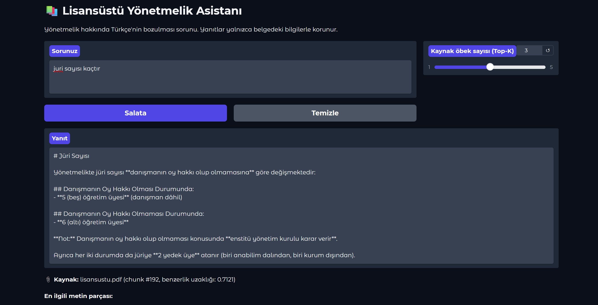
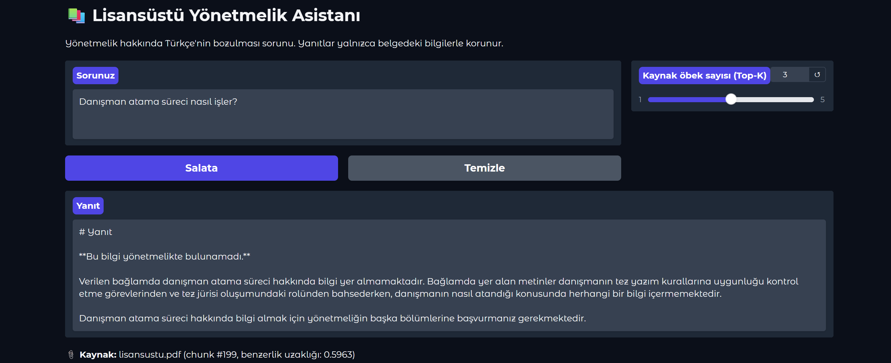

# 🎓 RAG Graduate Assistant

> **TR:** NLP kursu kapsamında geliştirilen, lisansüstü eğitim yönetmeliği üzerinde çalışan RAG tabanlı soru-cevap sistemi.  
> **EN:** A RAG-based Q&A system developed during an NLP course, designed to answer questions over graduate education regulation documents.

---

## 📌 Proje Hakkında / About

**TR:**  
Bu proje, bir NLP dersi çerçevesinde geliştirilmiştir. `lisansustu.pdf` dosyasından anlamlı bilgi parçaları (chunk) çıkarılarak ChromaDB vektör veritabanına kaydedilmiş ve Anthropic Claude API ile sorgulanabilir hale getirilmiştir.

**EN:**  
This project was built as part of an NLP course. It extracts meaningful chunks from `lisansustu.pdf`, stores them in a ChromaDB vector database, and enables semantic querying via the Anthropic Claude API.

---

## ⚙️ Pipeline

```
PDF → Text Extraction → Chunking → Vector Embeddings → Semantic Retrieval → Claude API Response
```

| Adım / Step | Açıklama / Description |
|---|---|
| 1. PDF → Metin | pdfplumber ile metin çıkarma / Text extraction with pdfplumber |
| 2. Metin → Chunk | Karakter + token bazlı hibrit bölme / Hybrid chunking |
| 3. Chunk → Vektör | ChromaDB'ye embedding kaydetme / Storing embeddings in ChromaDB |
| 4. Sorgu → Erişim | Anlamsal arama / Semantic retrieval |
| 5. Bağlam + Sorgu → Yanıt | Claude API ile yanıt üretme / Response generation with Claude API |

---

## 🛠️ Teknolojiler / Technologies

- **Python**
- **ChromaDB** — Vektör veritabanı / Vector database
- **Anthropic Claude API** (`claude-haiku-3-5`) — Dil modeli / Language model
- **pdfplumber** — PDF metin çıkarma / PDF text extraction
- **Google Colab** — Geliştirme ortamı / Development environment

---

## 🚀 Kurulum / Setup

```bash
pip install chromadb anthropic pdfplumber
```

> `.ipynb` dosyasını Google Colab'da açmak için yukarıdaki **"Open in Colab"** butonunu kullanabilirsiniz.  
> You can use the **"Open in Colab"** badge above to open the notebook directly in Google Colab.

---

## 💡 Kullanım / Usage

1. `lisansustu.pdf` dosyasını Colab ortamına yükle / Upload `lisansustu.pdf` to your Colab environment
2. Notebook'u sırayla çalıştır / Run the notebook cells in order
3. Son hücrede sorunuzu yazın / Enter your question in the last cell

---

## 📚 Kurs / Course

Bu proje bir **Doğal Dil İşleme (NLP)** kursu kapsamında geliştirilmiştir.  
This project was developed as part of a **Natural Language Processing (NLP)** course.

## 🖥️ Arayüz / Interface



